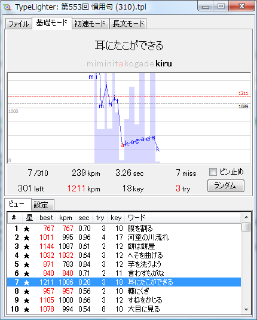
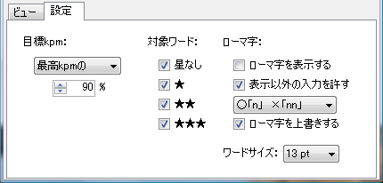
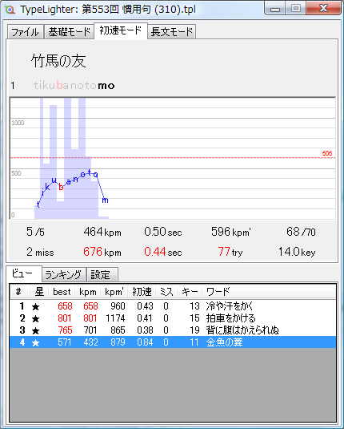
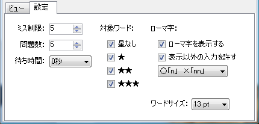
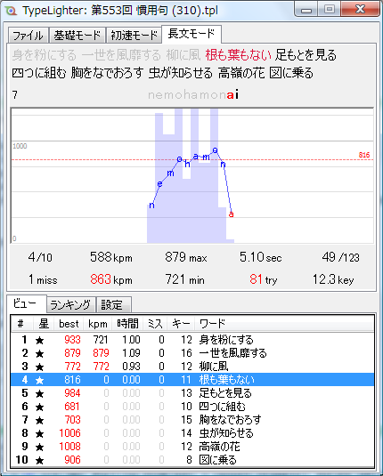
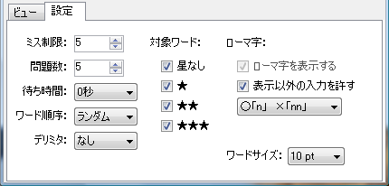
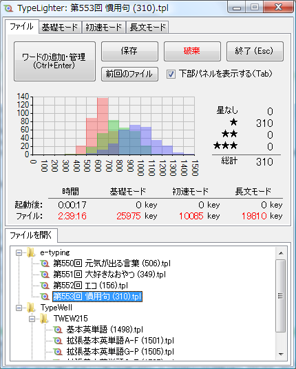
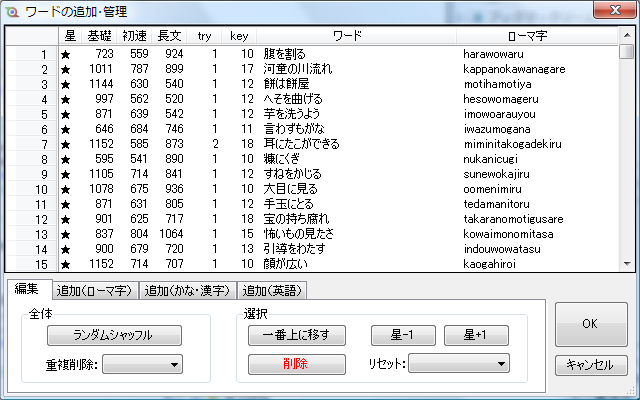

> [!CAUTION]
> 本ソフトウェアは、以下で公開されていたものです。  
> <http://hagane-forge.sakura.ne.jp/software/typelighter/>
> 
> 2011年に開発され、それ以降は保守管理されていません。

#  TypeLighter 

## ダウンロード

[TypeLighter.zip (2011-12-27)](html/TypeLighter.zip?raw=true)

## 概要

TypeLighter は、タイピング練習用のフリーソフトです (Windows 7 ～) 。

## スクリーンショット

### 基礎モード

・目標ライン（黒破線）をミス0で越えるまで同じワードを繰り返します。

・設定画面

### 初速モード

・[e-typing](https://www.e-typing.ne.jp/) 互換モード

・設定画面

### 長文モード

・TypeWell 互換モード

・設定画面

### ファイルタブ

・ファイルの統計など

### ワード追加・管理

・ワードの追加、編集、ソートなど

